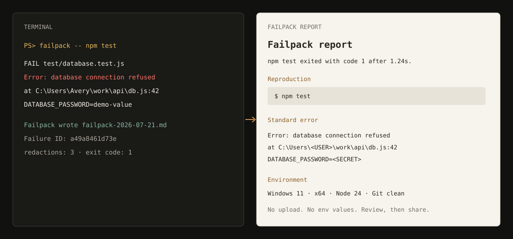

# Failpack

[](https://github.com/lavenzaP/failpack/actions/workflows/ci.yml)
[](https://nodejs.org/)
[한국어 README](README.ko.md)

**Turn one failed command into a bug report someone else can reproduce.**

```powershell
npx --yes github:lavenzaP/failpack -- npm test
```

Failpack runs the command, streams its output normally, and writes a sanitized Markdown report containing the exact reproduction command, exit code, recent output, OS and relevant runtimes, project markers, and a Git snapshot. It returns the wrapped command's exit code, so failures still fail in CI.



[Open a real generated report](docs/sample-report.md).

## Why

GitHub's own bug-report example asks for the reproduction steps, environment, and relevant logs. In practice, those details are often gathered after somebody has already said “works on my machine.” [Failpack captures them during the failing run](https://docs.github.com/en/communities/using-templates-to-encourage-useful-issues-and-pull-requests/syntax-for-issue-forms#converting-a-markdown-issue-template-to-a-yaml-issue-form-template).

Tools such as [`envinfo`](https://github.com/tabrindle/envinfo) collect environment data. Failpack covers the adjacent missing step: run the real failing command, preserve its exit behavior, attach a small Git snapshot, and redact the resulting report before it leaves the machine.

## Install

Run directly from GitHub:

```powershell
npx --yes github:lavenzaP/failpack -- npm test
```

Or install a cloned checkout:

```powershell
git clone https://github.com/lavenzaP/failpack.git
cd failpack
npm install -g .
failpack -- npm test
```

Requires Node.js 20 or newer. There are no runtime dependencies.

## Usage

Anything after `--` is the command to capture:

```powershell
failpack -- pytest -q
failpack -- dotnet test
failpack -- cargo test
failpack --output issue.md -- npm run build
failpack --max-output 1024 -- pnpm test
failpack --no-git -- node reproduce.js
```

```text
Options:
  -o, --output <file>   Report path (default: timestamped file in cwd)
      --max-output <KB> Keep the last KB of stdout and stderr (default: 512)
      --no-git          Skip branch, commit, status, and diff summaries
  -h, --help            Show help
  -v, --version         Show version
```

The report keeps the tail of very large output because failures usually finish with the useful stack trace. Truncation is marked explicitly.

## What goes into a report

| Collected | Deliberately not collected |
| --- | --- |
| Exact command and arguments | Environment-variable values |
| Exit code, signal, and duration | Source-file contents |
| stdout and stderr tail | Hostname and IP addresses |
| OS, architecture, relevant tool versions | Git remotes |
| Detected manifests and lockfiles | Full Git diffs |
| Branch, commit, status, and diff summaries | Automatic uploads or analytics |

Runtime detection follows the files in the current directory. For example, Failpack checks Python only when it sees `pyproject.toml`, `requirements.txt`, `Pipfile`, or `uv.lock`.

## Redaction

Before writing the report, Failpack replaces:

- Windows, macOS, and Linux user-home paths;
- email addresses;
- Bearer tokens and JWTs;
- GitHub, AWS, and OpenAI-style keys;
- credential-bearing URLs;
- assignments whose names end in `token`, `password`, `secret`, `api_key`, and related forms.

Raw command output is still streamed to your own terminal. Only the saved report is sanitized. Pattern matching cannot understand every project-specific identifier, so review the report before posting it publicly.

## Failure IDs

Each report includes a 12-character fingerprint derived from the sanitized command, exit code, and captured output. Timestamps, memory addresses, and durations are normalized, making repeated copies of the same failure easier to recognize without uploading anything.

## Scope

Failpack does not diagnose the bug, inspect source code, or create a minimal reproduction automatically. It makes the first support handoff complete and safer; a human still decides what the failure means.

## Development

```powershell
npm run check
npm test
npm run pack:check
node bin/failpack.js -- node examples/demo-failure.js
```

Tests cover argument parsing, output truncation, project detection, Markdown safety, secret redaction, command execution, exit-code preservation, and the full CLI report flow across Windows, macOS, and Linux CI runners.

## License

MIT
